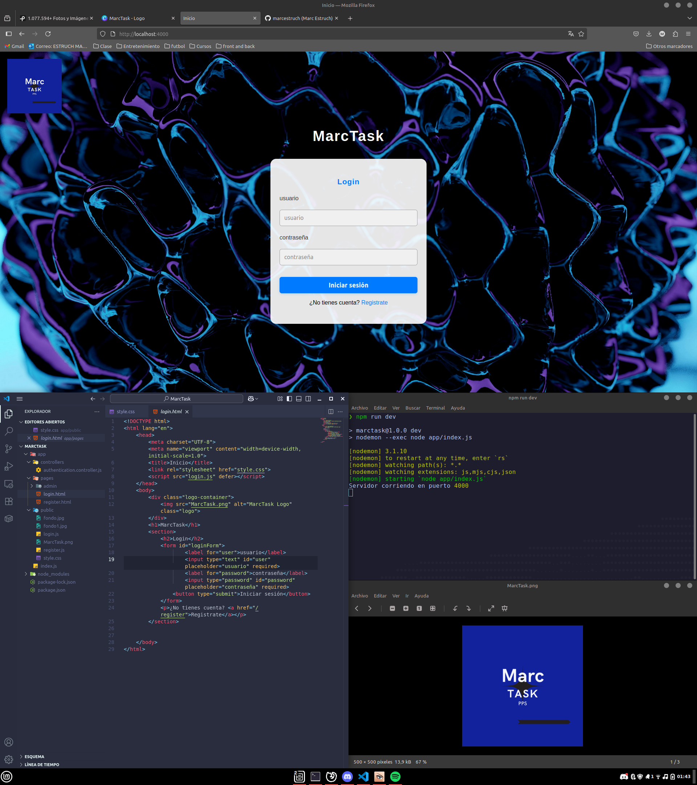

# MarcTask

MarcTask es una aplicación web para la gestión de tareas, con sistema de registro y login de usuarios.

## Estructura del proyecto

## Instalación

1. Clona el repositorio.
2. Instala las dependencias:

   ```sh
   npm install
   ```
    ```sh
    npm run dev
    ```
# MarcTask

MarcTask es una aplicación web para la gestión de tareas, con sistema de registro y login de usuarios.

## Estructura del proyecto


app/
  index.js
  controllers/
    authentication.controller.js
  pages/
    login.html
    register.html
    admin/
      crearTareas.html
      menu.html
      verTareas.html
  public/
    fondo.jpg
    fondo1.jpg
    login.js
    MarcTask.png
    register.js
    style.css
img/
  MarcTask-md1.png
package.json
README.md


## Instalación

1. Clona el repositorio.
2. Instala las dependencias:

   ```sh
   npm install
   ```

3. Inicia el servidor en modo desarrollo:

   ```sh
   npm run dev
   ```

El servidor se ejecutará en [http://localhost:4000](http://localhost:4000).

## Scripts

- `npm run dev`: Inicia el servidor con nodemon para recarga automática.

## Funcionalidades

- Registro de usuarios.
- Login de usuarios.
- Menú de administración.
- Creación y visualización de tareas (estructura preparada).

## Estructura principal

- **Backend:** Express.js (`app/index.js`), controladores en `app/controllers/authentication.controller.js`.
- **Frontend:** HTML, CSS y JS en `app/pages/` y `app/public/`.

## Créditos

Desarrollado por Marc Estruch.


